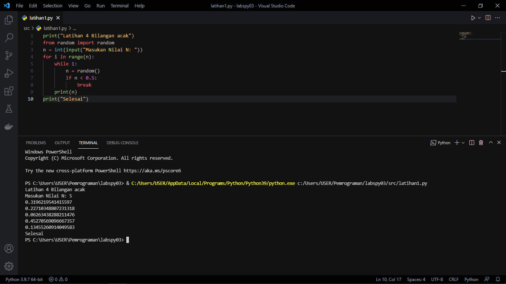
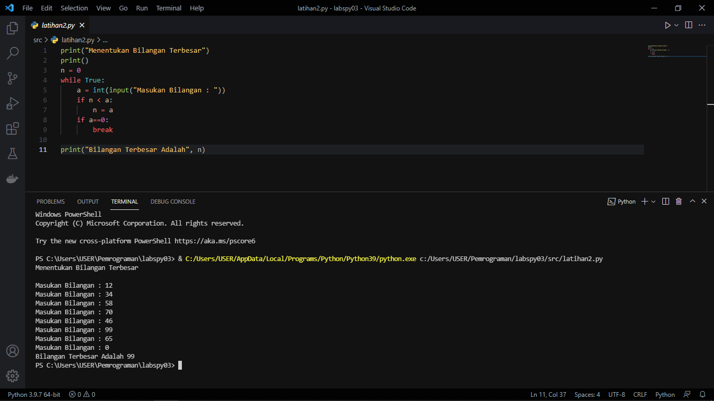
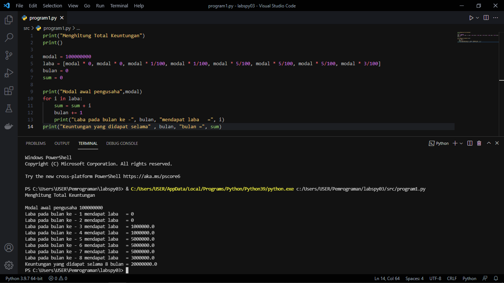

# Labspy03
## Daftar isi
- [Latihan 1](https://github.com/kyuurazz/labspy03/#latihan-1)
- [Latihan 2](https://github.com/kyuurazz/labspy03/#latihan-2)
- [Program 1](https://github.com/kyuurazz/labspy03/#program-1)
# Latihan 1
Program Menampilkan N Bilangan Acak yang Lebih Kecil dari 0.5



Penjelasan: 

1. Import module random untuk membuat bilangan acak
```bash
from random import random
```
2. Untuk menginput nilai yang ingin dikonversikan kedalam bilangan bulat (Integer) yang akan di masukan kedalam variabel `n`
```bash
n = int(input("Masukan Nilai N: "))
```
3. Untuk pengulangan range yang diinputkan oleh variable `n`
```bash
for i in range(n):
    while True:
        n = random()
        if n < 0.5:
```
4. Menampilkan hasil dari `n`
```bash
print(n)
```

# Latihan 2
Program Sederhana Menentukan Bilangan Terbesar, dari Data N yang diinputkan



Penjelasan: 

1. Deklarasi Variabel
```bash
n = 0
```
2. Untuk perulangan sampai waktu yang tidak ditentukan (While Loop)
```bash
while True:
```
3. Untuk menginput bilangan yang akan dimasukan kedalam variabel `a`
```bash
a = int(input("Masukan bilangan : "))
```
4. Jika n kurang dari a, maka variabel `n` = a (angka yang diinputkan)
```bash
if n < a:
        n = a
```
5. Jika `a` = 0, maka perulangan (loop) akan dihentikan dengan fungsi break
```bash
if a==0:
        break
```
6. Menampilkan hasil bilangan terbesar dari variabel `n`
```bash
print("Bilangan Terbesar Adalah", n)
```

# Program 1
Menghitung Total Keuntungan



Penjelasan:

1. Dari variabel `laba` terdapat list `modal` dari bulan pertama hingga akhir
```bash
modal = 100000000
laba = [modal * 0, modal * 0, modal * 1/100, modal * 1/100, modal * 5/100, modal * 5/100, modal * 5/100, modal * 3/100]
bulan = 0
sum = 0
```
2. Menampilkan modal pertama yang diambil dari variabel `modal`
```bash
print("Modal awal pengusaha",modal)
```
3. Untuk melakukan perulangan variabel `i` kedalam variabel `laba`. agar variabel `i` mendapat akses list yang ada didalam variabel `laba`
```bash
for i in laba:
```
4. Variabel `sum` ditambahkan dengan variabel `i` yang akan diulang hingga program selesai
```bash
sum = sum + i
```
5. Variabel bulan, untuk menentukan bulan yang akan ditambahkan dengan nilai 1 terus menerus hingga program berakhir
```bash
bulan += 1
```
6. Menampilkan laba dari bulan pertama hingga bulan terakhir
```bash
print("Laba pada bulan ke -", bulan, "mendapat laba   =", i)
```
7. Menampilkan keuntungan yang di dapat selama 8 bulan
```bash
print("Keuntungan yang didapat selama" , bulan, "bulan =", sum)
```